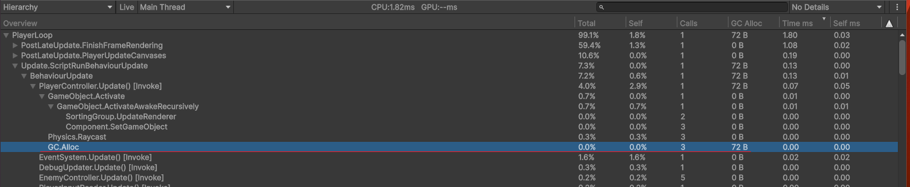
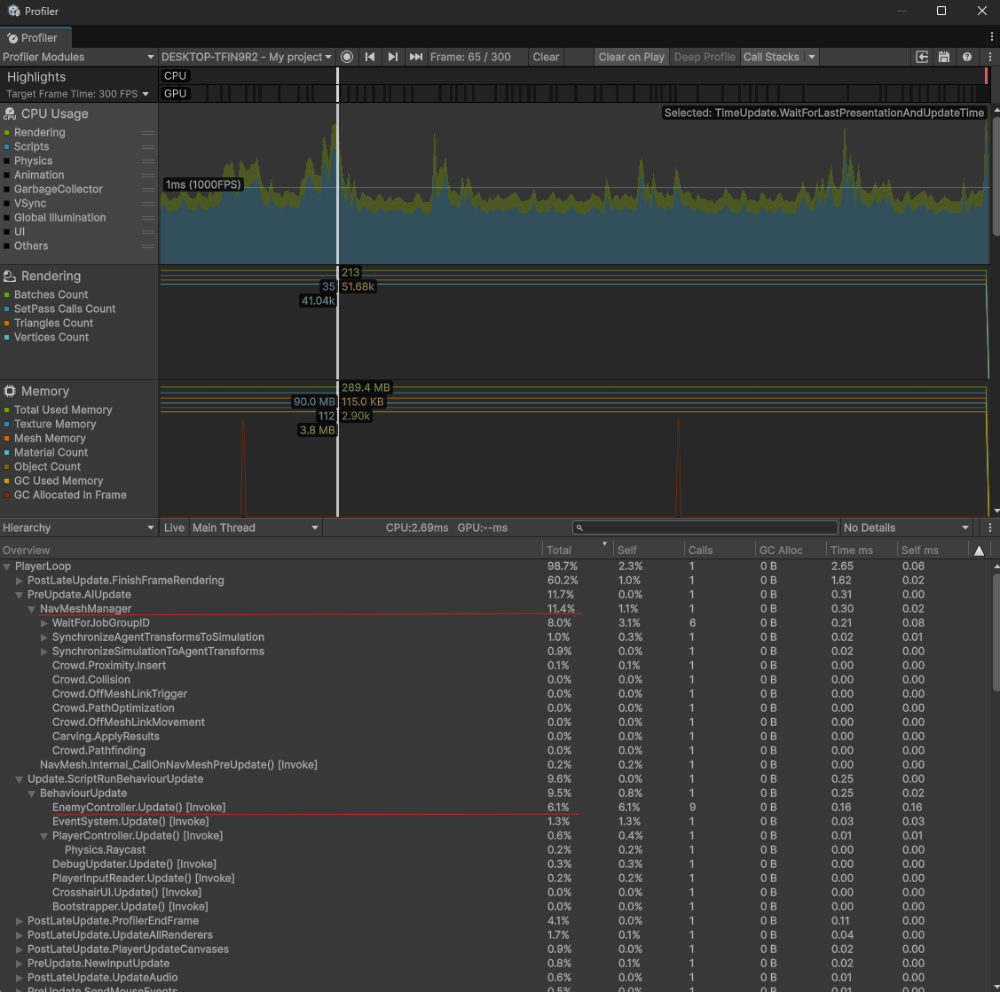
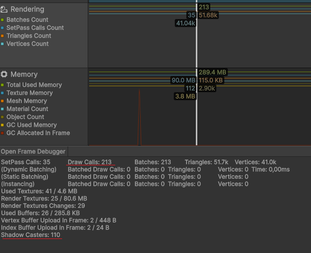
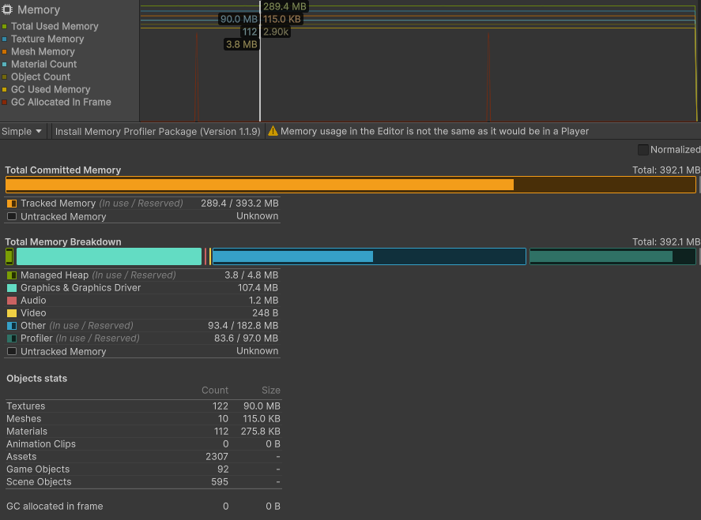
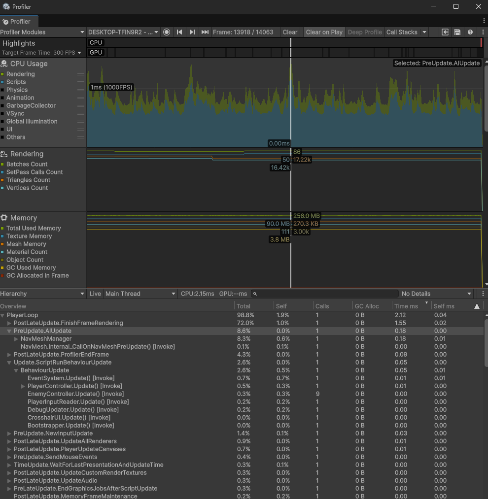
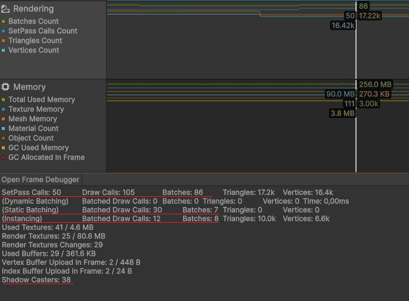
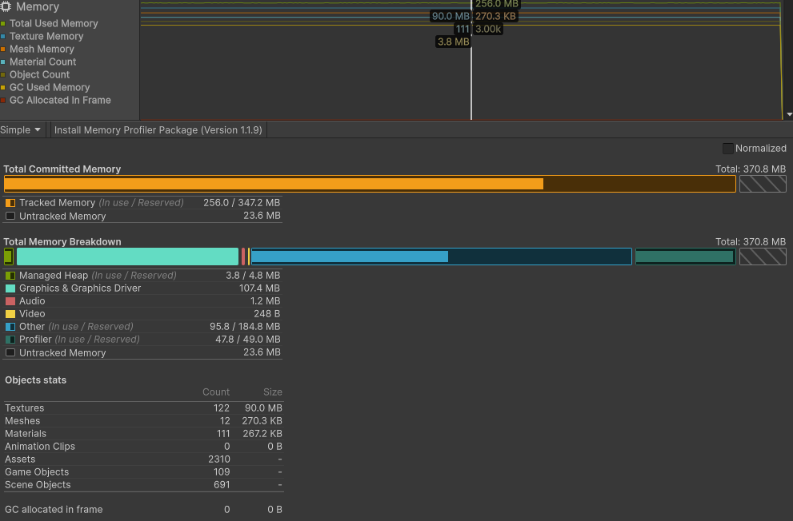

# Модуль 6. Расширенные возможности Unity
## Управление
- Нажатие ЛКМ - атака
- Нажатие ПКМ - движение в точку
- Зажатие ПКМ - вращение камерой
- Нажатие R - перезарядка

## Практика 3
В `\Docs\Profiling` лежат записи и скрины профилировщика до и после. 

Что сделал:
- Использовал Static Batching для статических объектов окружения
- Использовал GPU Instancing для материала врагов 
  - Немного потыкал Frame Debugger, пока проверял работоспособность обоих
- Уменьшил кол-во объектов, кастующих тени
- Уменьшил частоту время вызова EnemyController.Update()
- Добавил пулинг врагов 

Остались какие-то фантомные аллокации подобного плана, не смог понять почему =(   
Ещё в Bootstrapper.Update такую же картину видел

### Замеры ДО:

- Большая часть времени кадра тратится на обновление NavMeshManager из-за работы нескольких NavMeshAgent
- Метод EnemyController.Update выполняется каждый кадр для всех врагов и масштабируется с их количеством

Потенциальная оптимизация: 
- Применение Static Batching для объектов окружения
- Уменьшение кол-ва объектов, кастующих тени для уменьшения нагрузки при рендеринге
- Применение GPU Instancing для врагов

- Красные пики выделения памяти возникают при спавне врагов и создании трассеров выстрелов через Instantiate/Destroy без использования object pool

### Замеры ПОСЛЕ:

|                  | До                     | После |
|------------------|------------------------|-------|
| Время кадра (мс) | 1.6                    | 1.4   |
| GC Alloc         | От Instantiate/Destroy | ?     |
| Draw Calls       | 213                    | 105   |
