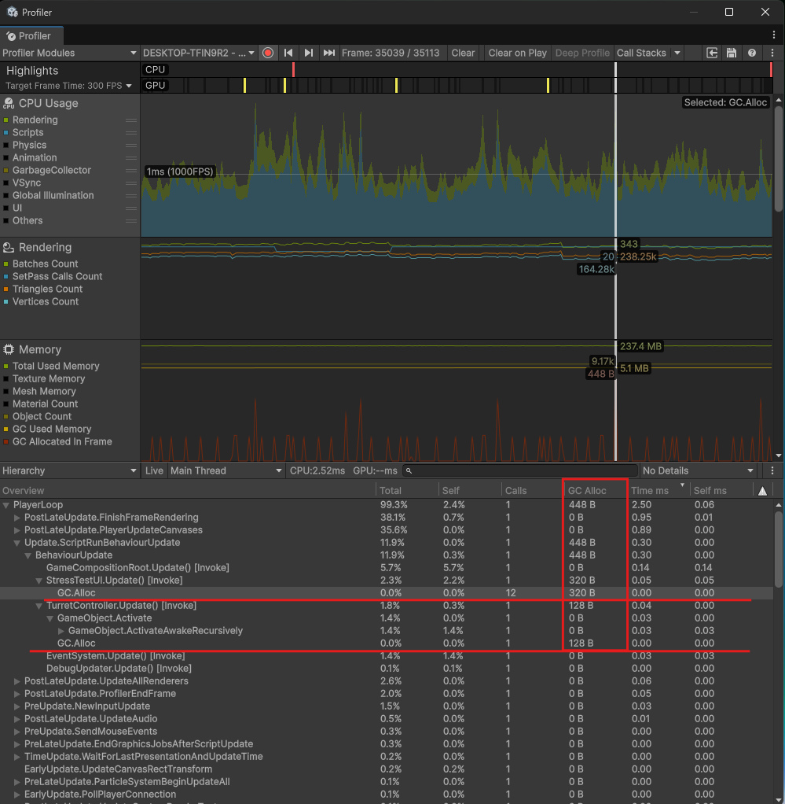
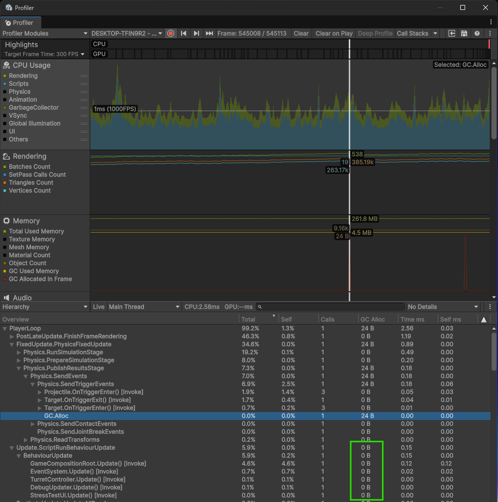

# Модуль 9. Оптимизация логики
## Практика 1
### Стресс-тестирование
**Условия теста:**
- Нагрузка: ~250 снарядов и ~50 целей одновременно (~300 объектов)
- Интенсивность: `Fire Rate` 0.01s, `Spawn Interval` 0.05s
- Пул: `Prewarm` 500

**Итоги**
- В Naive Mode основные потери производительности (20–40 FPS) вызваны работой сборщика мусора (GC), который замораживает поток для очистки памяти.
- В Pool Mode аллокации отсутствуют, что обеспечивает плавный геймплей без микро-фризов даже при большой нагрузке.
- Оптимизация UI через StringBuilder дополнительно устранила мелкий строковый мусор.
---
## Практика 2
### 1. Оптимизация `Update()`
   - Удалены индивидуальные Update(): Projectile, Target и TargetSpawner.

   - Замена:
     - Пакетное обновление: Перемещение снарядов и целей перенесено в ProjectileManager и TargetManager (OnTick).
     - Единая точка входа: Весь цикл обновления запускается централизованно через GameCompositionRoot.
     - Событийный подход: Таймер в спавнере заменен на корутину SpawnRoutine (yield return).
     
### 2. Декомпозиция `PoolSystem`
Система разделена на независимые модули по принципу SRP:
- EntityFactory: Логика создания объектов (Pool vs Naive).
- StatsCollector: Автономный сбор статистики и аналитики.
- PoolSystem: Легкий контейнер префабов и настроек инспектора.
- ObjectPool: Универсальный технический инструмент управления очередью.

### 3. Итоги
- Производительность: Снижены накладные расходы CPU за счет сокращения вызовов из C# в нативный код Unity и отказа от лишних проверок в Update.
- Архитектура: Достигнуто разделение между инфраструктурой, бизнес-логикой и данными (Domain / Infrastructure / Gameplay).
- Масштабируемость: Возможность расширения типов объектов без вмешательства в ядро систем.
---
## Практика 3
### Отчет по оптимизации проекта

#### 1. Условия Stress-test

* **Нагрузка:** ~250 снарядов и ~50 целей одновременно (~300 активных объектов в кадре)
* **Интенсивность:** `Fire Rate` — 0.01 сек, `Spawn Interval` — 0.05 сек
* **Объектный пул:** `Prewarm` — 500 единиц на каждый тип объекта
* **Время теста:** ~30 секунд

#### 2. Найденные проблемы и внесенные правки

1. **Лишние аллокации в UI**
* **Проблема:** Использование `Enum.ToString()` и `StringBuilder.Append(int)` для вывода статистики создавало ~320 байт мусора каждый кадр обновления.
* **Исправление:** Перешёл на использование метода `TMP_Text.SetText(format, value)`, который работает с числами без создания новых строк. Названия режимов игры закэшированы в статическом массиве строк, что исключило вызов `.ToString()` у Enum в runtime.

2. **Создание временных делегатов в EntityFactory**
* **Проблема:** При каждом выстреле или спавне цели в метод `Init` передавался метод освобождения (например, `ReleaseProjectile`). Передача метода напрямую заставляла C# создавать новый объект делегата в куче при каждом вызове (~24-48 байт за раз).
* **Исправление:** В конструкторе `EntityFactory` созданы и закэшированы ссылки на методы (поля типа `Action<T>`). Теперь в объекты передается готовая ссылка, что полностью убрало аллокации при создании сущностей.

3. **Избыточная нагрузка на CPU в логике турели**
* **Проблема:** Поиск лучшей цели выполнялся через `Vector3.Distance` в цикле по всем объектам. Это приводило к большому кол-ву операций извлечения квадратного корня (`Mathf.Sqrt`) в секунду. Также наблюдались частые обращения к native-свойствам `transform.position`.
* **Исправление:** Заменили `Vector3.Distance` на `sqrMagnitude` (сравнение квадратов расстояний), что математически легче для процессора. Кэшировали позицию и направление турели в локальные переменные внутри `Update`, чтобы минимизировать количество обращений к API движка.

4. **Низкая производительность при удалении объектов**

* **Проблема:** Использование `List<T>` в `EntityRegistry` приводило к снижению производительности при большом количестве объектов. Методы поиска и удаления (`List.Remove`, `List.Contains`) имеют линейную трудоёмкость $O(N)$, что в стресс-тесте вызывало резкие скачки нагрузки на CPU при деспавне снарядов и целей.
* **Исправление:** Тип коллекций в `EntityRegistry` изменён на `HashSet<T>`. Это обеспечило константную сложность $O(1)$ для операций добавления, поиска и удаления. Для исключения аллокаций при итерации (boxing нумератора) в менеджерах и турели используются конкретные типы `HashSet<T>` вместо интерфейсов.

#### 3. Итоговый результат

* **GC Alloc:** В игровом цикле аллокации мусора почти полностью устранены, остались только аллокация Physics движка.
* **Производительность:** График нагрузки на CPU стал более ровным, исчезли микро-фризы.